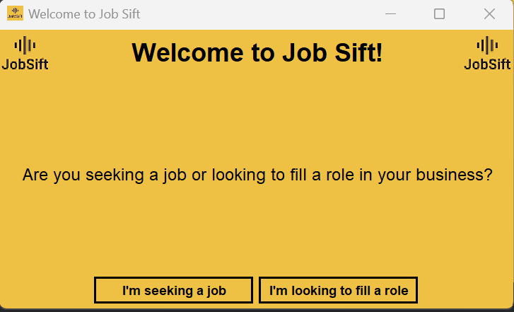
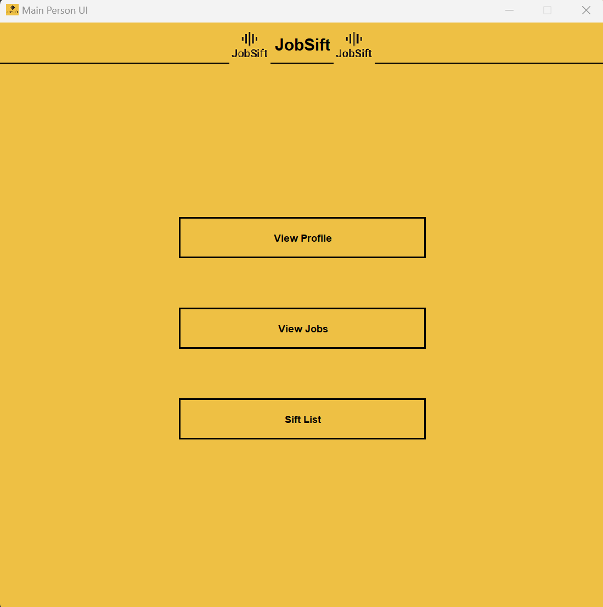
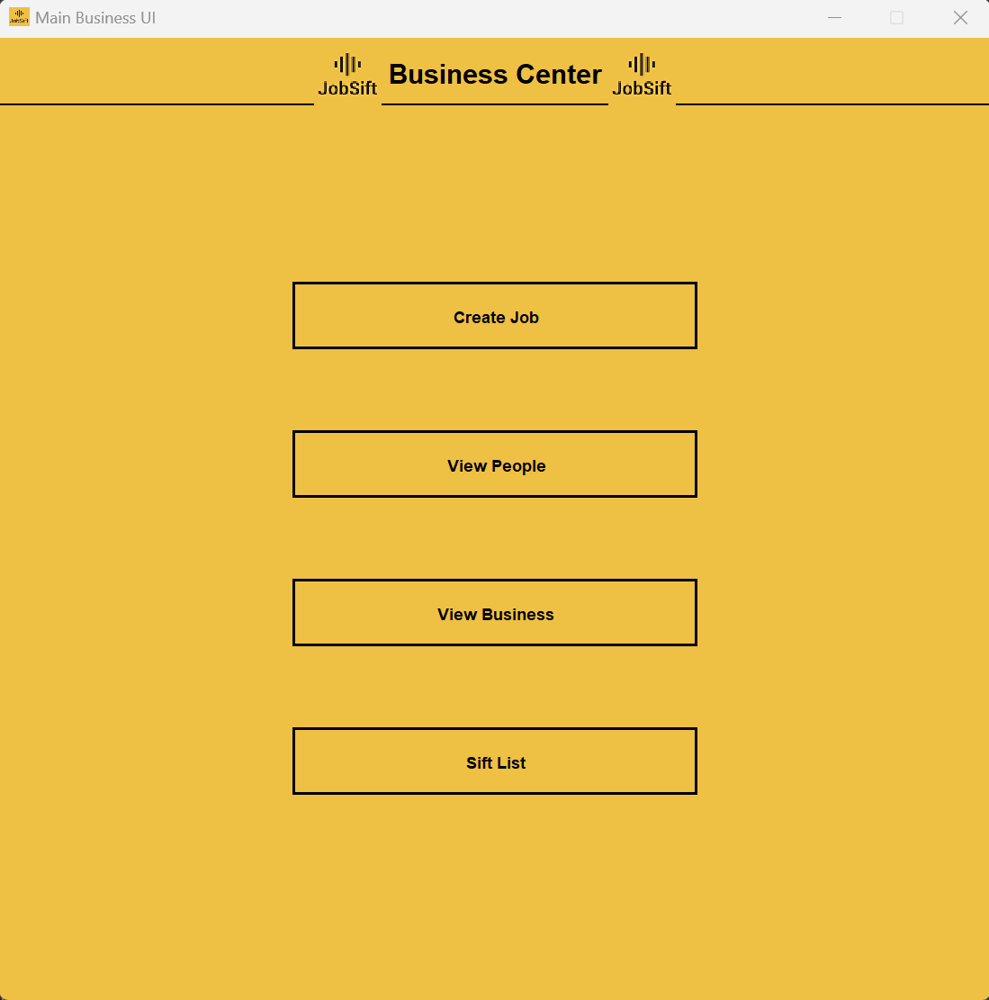

<!-- Improved compatibility of back to top link: See: https://github.com/othneildrew/Best-README-Template/pull/73 -->

<!--
*** Thanks for checking out the Best-README-Template. If you have a suggestion
*** that would make this better, please fork the repo and create a pull request
*** or simply open an issue with the tag "enhancement".
*** Don't forget to give the project a star!
*** Thanks again! Now go create something AMAZING! :D
-->

<!-- PROJECT SHIELDS -->
<!--
*** I'm using markdown "reference style" links for readability.
*** Reference links are enclosed in brackets [ ] instead of parentheses ( ).
*** See the bottom of this document for the declaration of the reference variables
*** for contributors-url, forks-url, etc. This is an optional, concise syntax you may use.
*** https://www.markdownguide.org/basic-syntax/#reference-style-links
-->

[![LinkedIn][linkedin-shield]][linkedin-url]

<!-- PROJECT LOGO -->
 

  

<h3 align="center">JobSift</h3>

  

    A Java project app using Swing that seeks to connect people seeking employment to companies with vacant roles
  

<!-- ABOUT THE PROJECT -->
## About The Project

Created individually using Java Swing and MongoDB during Summer 2023 as a side project to my internship. It is deployed on a AWS cluster through MongoDB atlas
so anyone who can run the project has access to the database. I created the logo using a free AI tool online.

The idea is that the user/business can sift through all of the potential applicants (for businesses)
or jobs (for users) and decide which ones to take a close look at. To do so, one adds the item to their
"sift list" where there is more detail on the person or position.

I learned a lot doing this project including but not limited too
* The difficulties of encoding PDF files so they can be saved in JSON format (used Base64)
* Deploying a project to a cloud cluster
* Connecting MongoDB to a Java project
* Java Swing
* Password Encryption
* So much more

<!-- GETTING STARTED -->
## Getting Started
To run the project you'll need to have a JRE already downloaded onto your computer, then just open the JAR file located 
[here](https://github.com/cdewitt02/JobSift/tree/main/out/artifacts/JobSift_jar). It is written in Java 19 but it might be
compatible with other Javas. I tried to make the project a .exe file but the file was too big for GitHub to handle normally. 
Contact me if you want the .exe file.
## Pictures

[linkedin-shield]: https://img.shields.io/badge/-LinkedIn-black.svg?style=for-the-badge&logo=linkedin&colorB=555
[linkedin-url]: https://linkedin.com/in/charlie-dewitt
